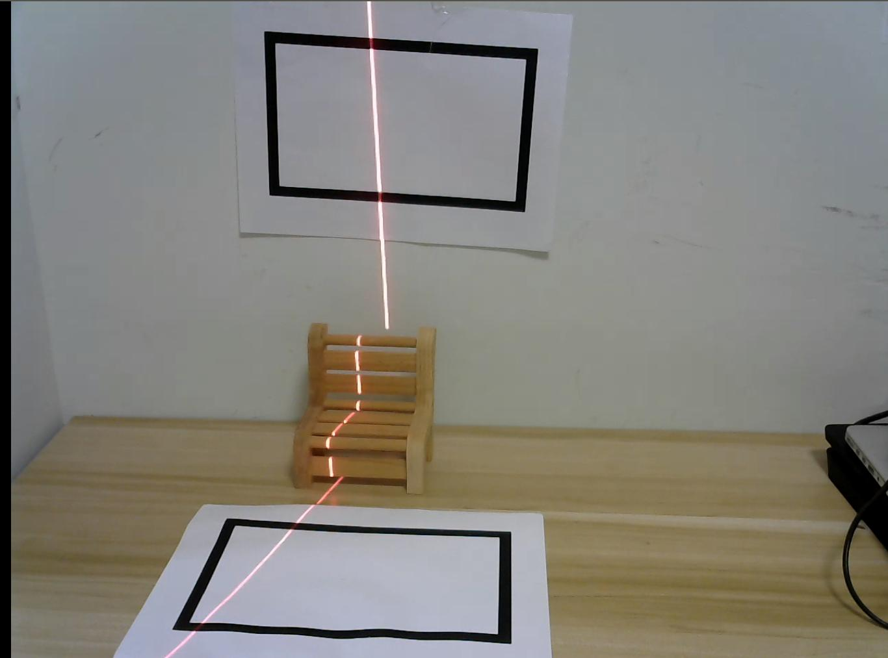

# Structured-Light-Scanner
基于线结构光的低成本简单粗糙的3D扫描仪，资料网上一大堆，简单写了一下代码

## 准备材料
* 一字激光
* 摄像头
* A4纸打印的标定板和长方形

## 依赖
* open3d
* opencv
* numpy

## 相机校准
`python lib/CameraCalibrator.py`

## 3D重建
#### 0. 找激光线HSV阈值
`python lib/hsv_helper.py`.

#### 1.运行
`python main.py`

#### 2.result

